# Real-Time AQI Monitoring Through AQI Sensors Mounted on Public Transport
.

[Link To Live Project](https://udyaansaathi.onrender.com/)
***
IOT Based Air Quality Index Monitoring &amp; utilizing ML and Data Visualization for analysis and prediction.
## Modules
1. [Pollution Sensing Device](#IoT)
2. [AQI Monitoring Website](#website)
3. [Prediction and Analysis using Various ML Techniques](#ml)

## Functionalities
***

### IOT based Air Pollution Sensing Device

1. Node MCU Board
2. MQ 135 Gas sensor
3. DHT 11 temperature sensor
4. GPS Module
5. I2C Converter
6. Wifi MCU (ESP8266)
7. LCD Display
8. Arduino Setup Libraries

 

### AQI Monitoring Website
***

1. Map
2. Air Quality Index Data
3. Major Air Pollutants
4. Health Advice
5. Most Polluted Cities
6. Historic Air Quality Data
7. Least Polluted Cities
8. AQI HeatMap

#### Details
1. **Map** 
    * For watching the continuous report of all the Sensors. 
      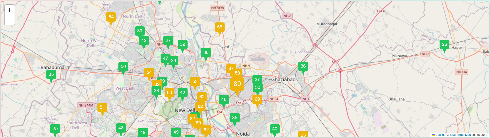
2. **Air Quality Index Data** 
    * Watching Monthly report of current month AQI.
    * Watching Hourly report of same day.
      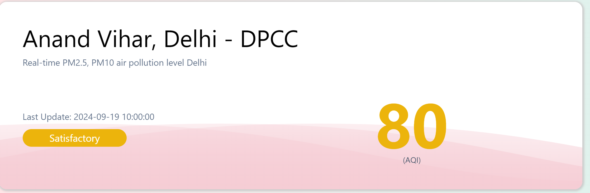
3. **Major Air Pollutants** 
    * Seeing next 7 day AQI forecast.
    * Seeing next 24 hours forecast.
      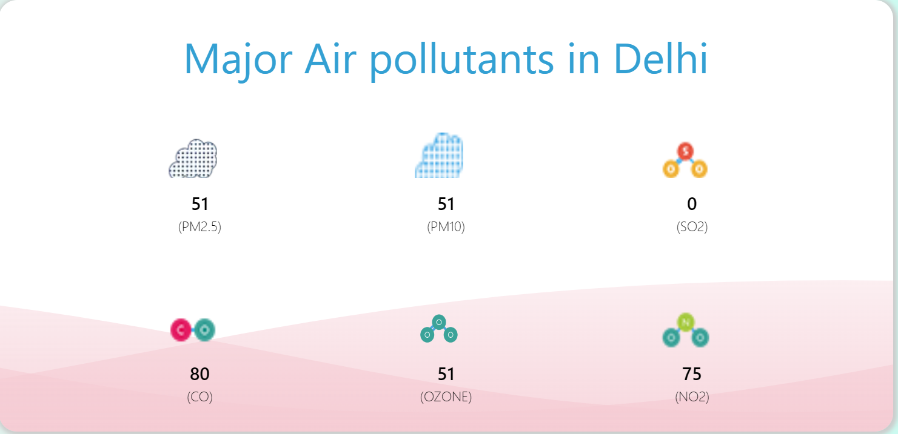
   
4. **Health Advice** 
    * Graphical repersantion of historical data based on selected Month or Day. 
      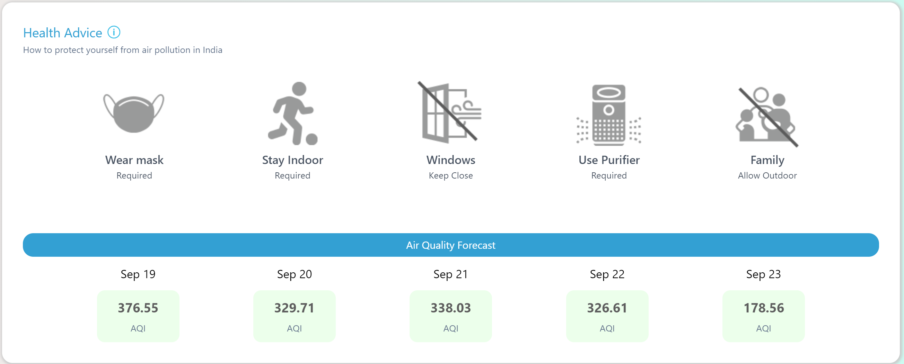
5. **Most Polluted Cities**
    * Provides alert on website whenever AQI level crosses the limit.
    * Provides consequences and precaution about the AQI levels.
      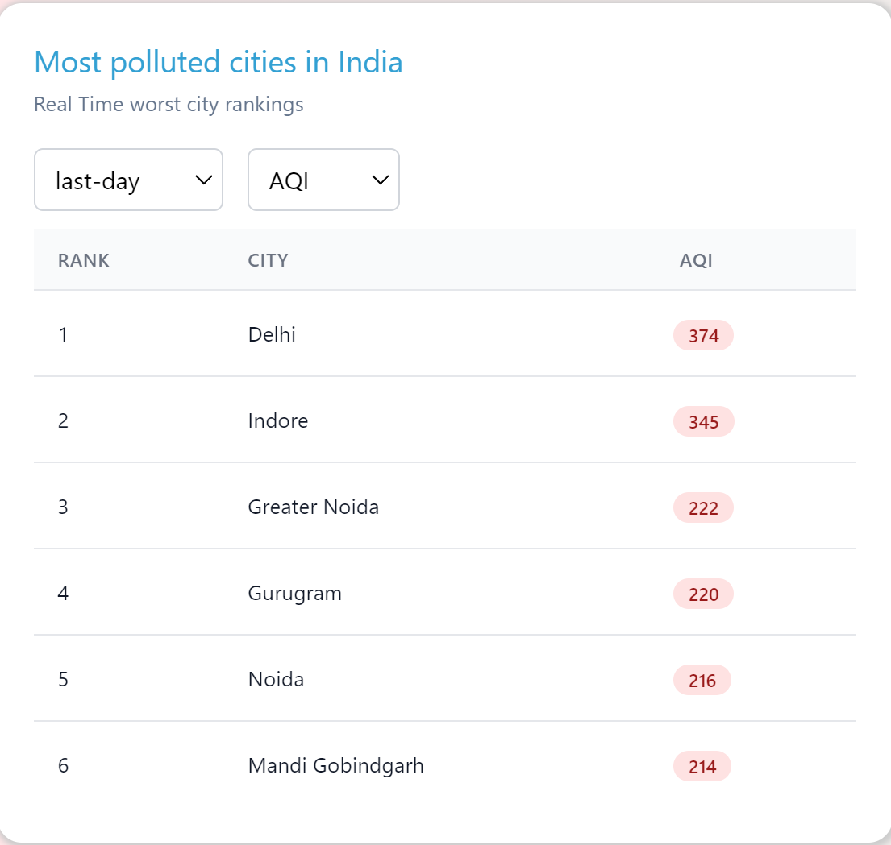
6. **Historic Air Quality Data**
    * dkfnonferjong
    * rkgerkgmetkgm
      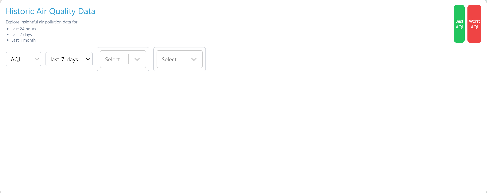
7. **Least Polluted Cities**
    * dkfnonferjong
    * rkgerkgmetkgm
      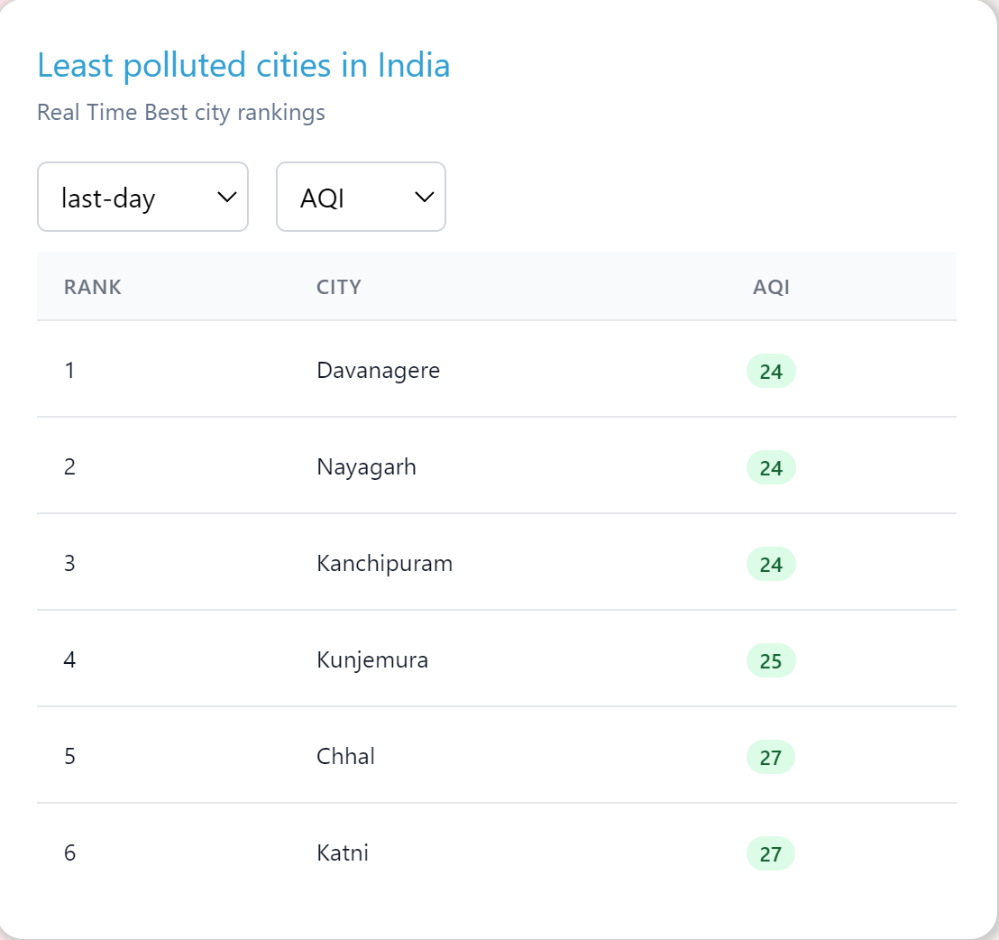
8. **AQI HeatMap**
    * dkfnonferjong
    * rkgerkgmetkgm
      
 

### Forecasting AQI
***
1. Collecting Dataset
2. Analysing Dataset
3. Training Models using ML
4. Forecasting Time-Series data

#### Details
1. **Collecting Dataset** 
    * Collecting Dataset from the website database of atlest 6 months. 
      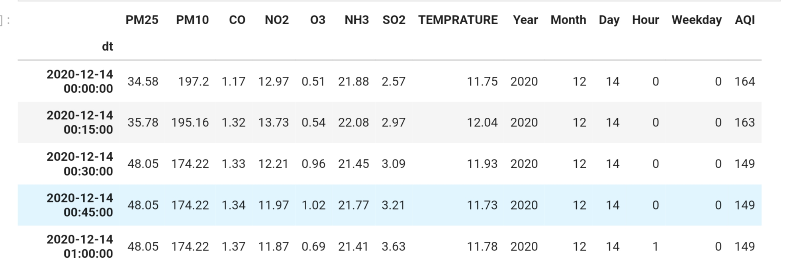
      
2. **Analysing Dataset** 
    * Exploratory data analysis on the dataset.
    * Wrangling and Preparing the Dataset.
    * Time-windowing the Dataset for time series data forecasting. 
      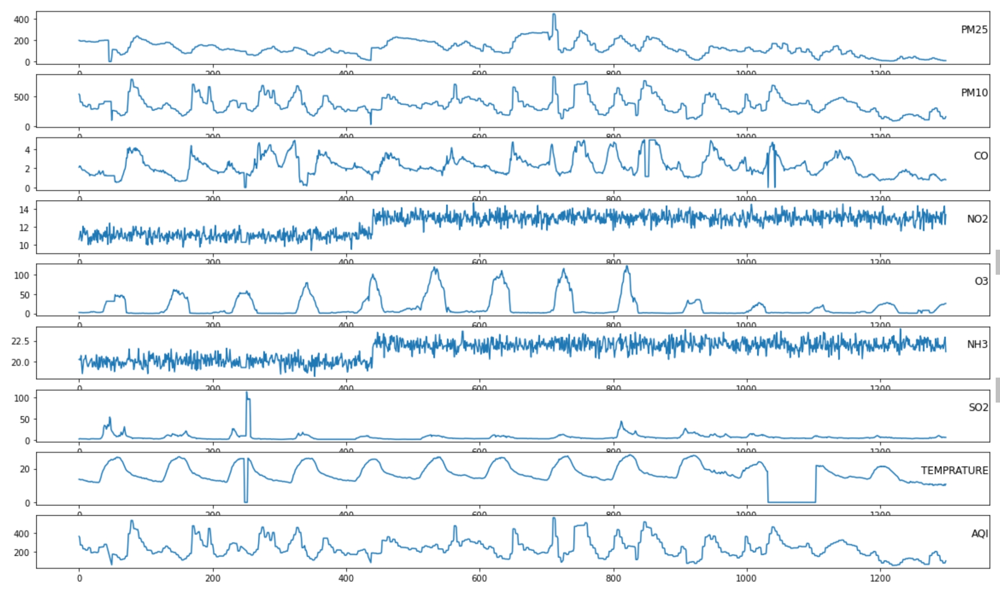
      
3. **Training Models using ML** 
    * Creating various Machine Learning models 
    * Applying various techniques to fit and forecast the data.
    * Comparing Various Designed Models. 
      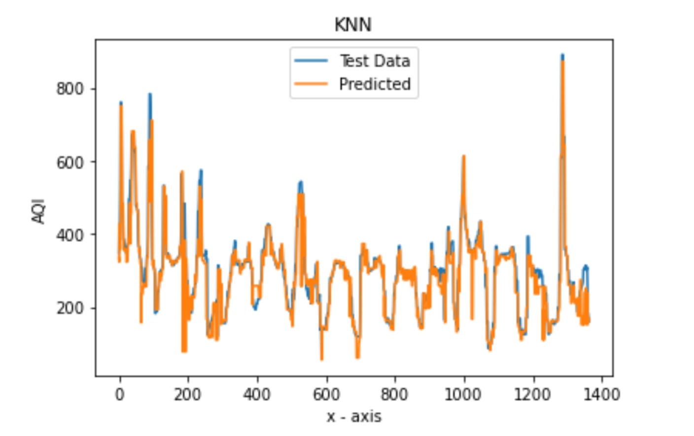
      
4. **Forecasting Time-Series data**
    * Finally using the best model to forecast AQI. 
      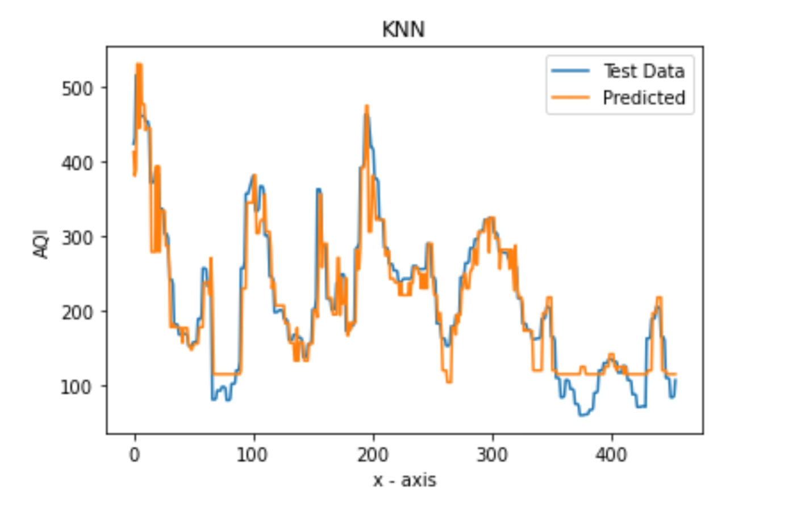

## Technologies
***
### A list of technologies used within the project:
**For Setting Up Iot Device**
* [Arduino](https://example.com): Version 1.3 
* [C](https://example.com): Version 1.3 
* [C++](https://example.com): Version 1.3 

**For Designing Website**
* [PHP](https://example.com): Version 1.3 
* [Javascript](https://example.com): Version 2.34
* [CSS](https://example.com): Version 1234
* [BootsTrap](https://example.com): Version 1234
* [MySQL](https://example.com): Version 1234
* [phpMyAdmin](https://example.com): Version 1234
* [Rest API](https://example.com): Version 12.3 

**For Forecasting**
* [Python](https://example.com): Version 12.3 
* [Machine Learning](https://example.com): Version 12.3 
* [Deep Learning](https://example.com): Version 12.3 
* [Anaconda](https://example.com): Version 12.3 
