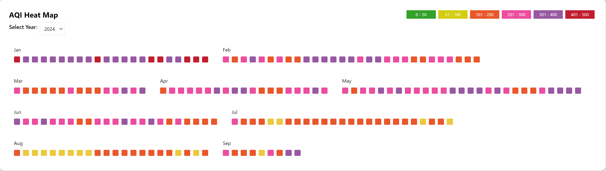

# Real-Time AQI Monitoring Through AQI Sensors Mounted on Public Transport
.

[Link To Live Project](https://udyaansaathi.onrender.com/)
***
IOT Based Air Quality Index Monitoring &amp; utilizing ML and Data Visualization for analysis and prediction.
## Modules
1. [Pollution Sensing Device](#IoT)
2. [AQI Monitoring Website](#website)
3. [Prediction and Analysis using Various ML Techniques](#ml)

## Functionalities
***

### IOT based Air Pollution Sensing Device

1. Node MCU Board
2. MQ 135 Gas sensor
3. DHT 11 temperature sensor
4. GPS Module
5. I2C Converter
6. Wifi MCU (ESP8266)
7. LCD Display
8. Arduino Setup Libraries

 

### AQI Monitoring Website
***

1. Map
2. Air Quality Index Data
3. Major Air Pollutants
4. Health Advice
5. Most Polluted Cities
6. Historic Air Quality Data
7. Least Polluted Cities
8. AQI HeatMap

#### Details
1. **Map** 
    * For watching the continuous report of all the Sensors at various part of the cities. 
      
2. **Air Quality Index Data** 
    * Watching real time report of same day.
    * real time data updation 
      
3. **Major Air Pollutants** 
    * Display of Pollutants in the Air.
    * Concentration of pollutants.
      
   
4. **Health Advice** 
    * Based on ML models Personalized Health Advice is displayed on the website. 
      
5. **Most Polluted Cities**
    * Display the Data regarding Most Polluted cities and area.
      
6. **Historic Air Quality Data**
    * Display the History of AQI data of the city.
      
7. **Least Polluted Cities**
    * Display the Data of Least Polluted Cities.
      
8. **AQI HeatMap**
    * Display The Heatmap of the City
      
 

### Forecasting AQI
***
1. Collecting Dataset
2. Analysing Dataset
3. Training Models using ML
4. Forecasting Time-Series data

#### Details
1. **Collecting Dataset** 
    * Collecting Dataset from the website database of atlest 6 months. 

      
2. **Analysing Dataset** 
    * Exploratory data analysis on the dataset.
    * Wrangling and Preparing the Dataset.
    * Time-windowing the Dataset for time series data forecasting. 

      
3. **Training Models using ML** 
    * Creating various Machine Learning models 
    * Applying various techniques to fit and forecast the data.
    * Comparing Various Designed Models. 
   
      
4. **Forecasting Time-Series data**
    * Finally using the best model to forecast AQI. 
 

## Technologies
***
### A list of technologies used within the project:
**For Setting Up Iot Device**
* [Arduino]
* [C]
* [C++]

**For Designing Website**
* [Javascript]
* [CSS]
* [BootsTrap]
* [MongoDB]
* [Rest API]

**For Forecasting**
* [Python](https://www.python.org/): Version 12.3 
* [Machine Learning]
* [Deep Learning](https://www.deeplearning.ai/): Version 12.3 
 
